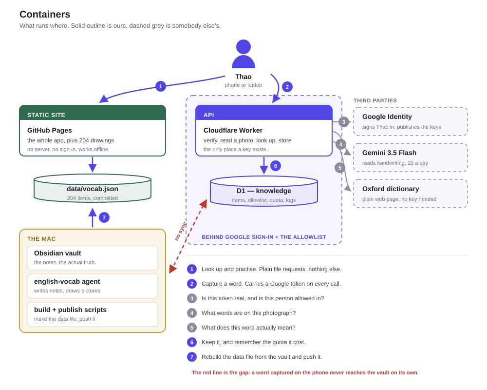
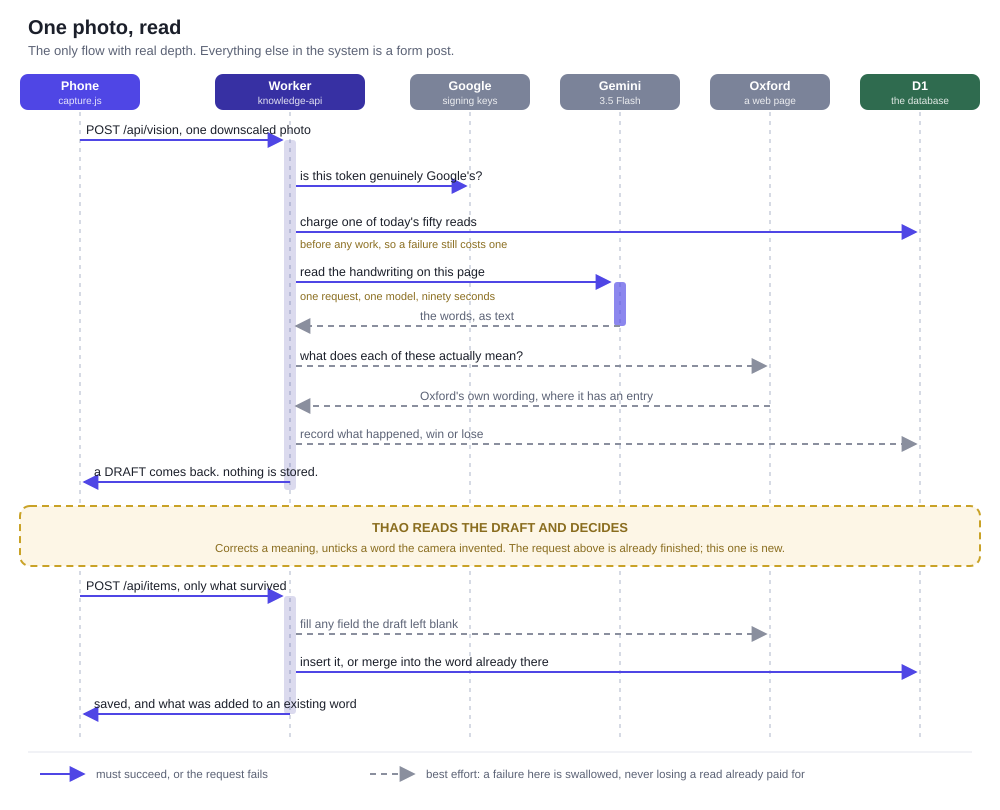

# Architecture

English Review is two systems sharing a browser tab. One is a static website that
needs no server at all: it ships the vocabulary alongside the code, so looking a word
up and practising it happen entirely in the browser. The other is a single Cloudflare
Worker, which exists because capturing a word means calling Gemini, and an API key
cannot live in a page whose source anyone can read. Almost everything else in this
document follows from that split, including its main defect: the two halves do not
talk to each other yet.

This is the structural view. The [README](../README.md) explains why the review method
works the way it does, and [how-a-word-gets-in.md](how-a-word-gets-in.md) explains who
is responsible for each step of adding a word.

## What runs where

The diagram below shows every running piece at once. Two things in it are worth more
than the rest: exactly one box holds a secret, and the Mac sits outside the cloud
entirely, reaching the site through git rather than through any API.

The static site is ordinary files on GitHub Pages with no build step, because there is
nothing to compile. Its data is a JSON snapshot of the vault committed next to the
code, which is why Look up works with the network off and without signing in.

The Worker is the only component that holds credentials, so it is also the only
component that needs the allowlist in front of it. It verifies a Google ID token,
checks the email against a table, and only then does any work. Nothing downstream of
it trusts a field the browser sent.

Google, Gemini and Oxford are drawn dashed because we do not control them, and each
one fails differently. Google going down means nobody can sign in. Gemini going down
means capture by photograph stops while typing a word still works. Oxford going down
means definitions arrive as the model's draft wording instead of the dictionary's,
which is a degradation rather than an outage.

The Mac is on the diagram because the vault it holds is the actual source of truth,
and nothing in the cloud can reach it. It lives on an external drive, so CI cannot
read it either, which is the reason the generated data file is committed to the repo
rather than built during deployment.

## The split that explains most surprises

The read path and the write path share a browser tab and nothing else. Recognising
that resolves nearly every question that starts with "why didn't my word show up".

| | Read path | Write path |
|---|---|---|
| Screens | Look up, Practise, Cards, Progress | Capture |
| Code | `app.js`, `review.js` | `capture.js`, `auth-client.js` |
| Data source | `data/vocab.json`, committed | D1, over HTTPS |
| Sign-in | not required | required |
| Works offline | yes, once cached | no |

A word captured on the phone today therefore sits in D1 while Look up still reads a
JSON file that knows nothing about it. It appears only after the Mac regenerates that
file and pushes. Closing this loop is what [sync.md](sync.md) designs, and it is the
largest unbuilt piece of the system.

## Reading a photograph

Capture by photograph is the only flow with real depth, and the diagram below encodes
three decisions that are easy to get wrong. The quota is charged before any work
starts, so a failed read still costs one of the day's requests. The human sits in the
middle, which turns one apparent action into two separate HTTP requests. And nothing
is written to the database until after that human step.

One photo costs exactly one request to one model. An earlier version tried three
models in sequence, which turned a bad minute into three of the day's twenty for no
gain, because when Gemini's free pool is saturated it is saturated for every model and
every key. A 401, 403 or 429 does mean that particular key is finished, so the next
key gets a turn; a 503 earns no retry at all.

The model transcribes, and Oxford defines. That division was not the original design.
The model was once asked for the meaning too and answered fluently, differently on
every run, and closely enough to Oxford to look right while saying "other people's
property" where Oxford says "public property". Oxford is a server-rendered web page,
so the Worker fetches it directly with a browser User-Agent, which costs no key and no
quota.

Both dashed calls in the diagram are wrapped so that their failure is swallowed. A
dictionary lookup that times out, or a log row that cannot be written, must never
destroy a read that has already been paid for.

## What holds the secrets

The trust boundary is the Worker, and everything in front of it is public on purpose.
The OAuth client ID in `config.js` identifies the app without authorising anything;
the static site and every note in `vocab.json` are meant to be readable.

The Gemini keys are Worker secrets. They are not in the repo, not in `config.js`, and
never reach a browser. The Worker reads `GEMINI_API_KEY` first and then any
`GEMINI_API_KEY_2`, `_3` and so on, in order, which means adding or retiring a key is
a `wrangler secret put` with no deploy and no code change. Use `./save-secret.sh NAME`
to enter one without it landing in shell history.

The allowlist is rows in the `user` table rather than a constant in code, so granting
or revoking access needs no deployment. If a session token were ever stolen, the
damage is bounded at fifty image reads that day for that one person, because
`usage_counter` is charged before the model is called. CORS echoes an allowed origin
instead of wildcarding, but that is hygiene rather than a control: `curl` ignores CORS
entirely, and the token is what actually protects the endpoint.

## Where the state lives

Four stores, with different lifetimes, and confusing them is how you lose work.

| Store | Holds | Scope | Survives |
|---|---|---|---|
| Obsidian vault | the notes themselves | the Mac | everything; it is the truth |
| `data/vocab.json` | a generated snapshot, 204 items | committed to the repo | until the next regeneration |
| D1 `knowledge` | captured items, allowlist, quota, read logs | Cloudflare | independently of the repo |
| `localStorage` | review progress, current deck, theme | one browser on one device | until site data is cleared |

Review progress is the one to watch. The schema has `review_state` and `review_log`
tables ready for it, but nothing writes them, so practising on the laptop leaves the
phone's schedule untouched. Moving progress between devices means using Progress then
Export.

## The technology, and why each piece

Every choice here was made to keep the running system small enough for one person to
hold in their head.

| Layer | Choice | Reason |
|---|---|---|
| Front end | vanilla ES modules, no framework, no build | about 2 100 lines; a build step would cost more than it saves |
| Scheduling | FSRS-6 via vendored [`ts-fsrs`](https://github.com/open-spaced-repetition/ts-fsrs) | the algorithm Anki adopted; vendored so the site needs no npm install |
| Static hosting | GitHub Pages, straight from `main` | free, and every push republishes |
| API | Cloudflare Workers | needed only to hold a secret; the free tier covers one person |
| Database | Cloudflare D1 | the tests run the same SQL against plain SQLite |
| Region pinning | Durable Object `RegionalFetcher` | Gemini is not served everywhere a Worker may run, so the relay moves the call |
| Identity | Google Sign-In, RS256 ID tokens | no password to store and no session table to keep |
| Transcription | Gemini 3.5 Flash, free tier | twenty requests a day per model, which is the binding constraint on the whole feature |
| Definitions | Oxford Learner's Dictionaries over plain HTTP | server-rendered, so no key and no quota |
| Tests | Node's built-in runner plus headless Chrome over CDP | no test framework to keep up to date |

Taken together these keep the operational surface at two deployables and no build
pipeline, which is why the project can sit untouched for a month and still work.

## Publishing

There are four independent ways to ship a change, and they do not coordinate.

| What changed | How it ships | Live in |
|---|---|---|
| site code, styles, drawings | `git push origin main` | about ten minutes |
| vault notes | `_System/Scripts/publish_site.sh` | about ten minutes |
| Worker code | `wrangler deploy` from `worker/` | seconds |
| database schema | `wrangler d1 execute knowledge --remote --command "…"` | immediately |

Two traps here have each cost an afternoon already. The first is that
`wrangler secret put` creates a deployment, and that deployment redeploys the existing
bundle rather than your local code, so `wrangler deployments list` can show a recent
entry while the code running is days old. Read the `Source` column before believing a
deploy happened. The second is that `wrangler d1 execute --file` goes through D1's
import API, which an OAuth `wrangler login` cannot reach at all; use `--command` for
anything short enough.

`.github/deploy.yml.disabled` is a working Actions workflow that would additionally
refuse to publish an empty `vocab.json`. Enabling it needs a token with the `workflow`
scope, and the README has the steps.

## Testing

`./test/run.sh` runs 463 assertions across nine suites in about a minute.

| Suite | Covers |
|---|---|
| `engine` | grading, typo tolerance, FSRS scheduling, queue building |
| `auth` | token verification: signature, audience, issuer, expiry, clock skew |
| `oxford` | slug generation and HTML parsing, against saved fixtures |
| `api` | Worker routes against real SQLite, with Gemini and Google stubbed |
| `ui`, `capture`, `cards`, `gate`, `mobile` | the real DOM in headless Chrome over the DevTools protocol |

The browser suites matter most, because this project's bugs have overwhelmingly been
interface bugs rather than logic bugs. A fix is not finished until they pass.

`test/live.mjs` goes all the way out to Gemini with the real key and is deliberately
kept out of `run.sh`, since every run spends daily quota.

## What is not finished

The sync agent is designed and not built, so D1 and the vault drift apart with every
captured word. `review_state` and `review_log` are dead tables for the same reason,
waiting for progress to move off the device. Migration `0003-seed-from-vault.sql` has
not been applied, which means the duplicate check currently sees only words that
arrived through capture rather than the 204 already in the vault.

Three smaller things are stale rather than missing. The comment in `wrangler.toml`
still describes a model chain that no longer exists. `tools/find_images.py` and
`tools/contact_sheet.py` are the superseded stock-image pipeline, left in place and
unused now that drawings are made by hand. And idioms are never verified against
Oxford, because none of the nineteen has an entry; head-word lookup was measured,
matched thirteen of fifty-three phrases and only about three correctly, and was
rejected on the grounds that a confidently wrong definition is worse than a blank one.
