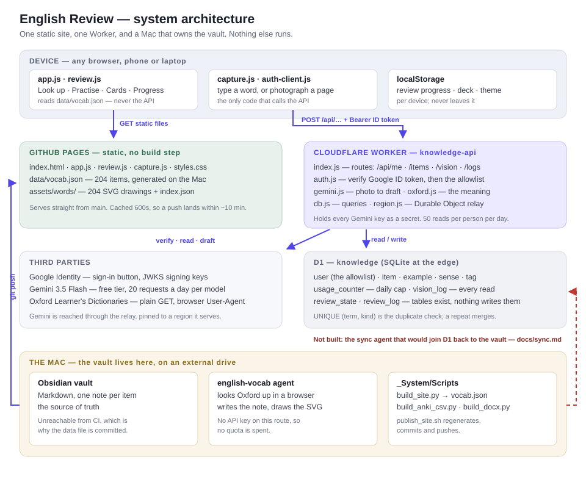

# Architecture

What this system is made of and where each decision lives. Written for whoever
picks the project up next — including a future session that has forgotten it.

For *why the review method works the way it does*, see the [README](../README.md).
For *how a word enters the system*, see [how-a-word-gets-in.md](how-a-word-gets-in.md).
This document is the structural view: components, boundaries, and state.

## The shape in one paragraph

A static site does the reading, a Worker does the writing, and a Mac owns the
truth. The site is plain files on GitHub Pages with a snapshot of the vault
committed next to them, so looking a word up and practising it needs no server
at all. Capture is the only feature that needs one, and it gets a single
Cloudflare Worker — there because an API key cannot live in a browser.

## Tech stack

| Layer | Choice | Why this one |
|---|---|---|
| Front end | Vanilla ES modules, no framework, no build | ~2 100 lines; a build step would cost more than it saves |
| Styling | One hand-written `styles.css`, light + dark | Small enough to read end to end |
| Scheduling | FSRS‑6 via vendored [`ts-fsrs`](https://github.com/open-spaced-repetition/ts-fsrs) | The algorithm Anki adopted; vendored so the site has no npm install |
| Static hosting | GitHub Pages, straight from `main` | Free, and every push republishes |
| API | Cloudflare Workers (`knowledge-api`) | Needed only to hold a secret; free tier covers one person |
| Database | Cloudflare D1 (SQLite at the edge) | Same SQL as the tests run against locally |
| Region pinning | Durable Object `RegionalFetcher` | Gemini is not served everywhere a Worker may run; the relay moves the call |
| Identity | Google Sign-In (ID token, RS256) | No password to store, no session table |
| OCR / drafting | Gemini 3.5 Flash, free tier | 20 requests a day per model — the binding constraint |
| Definitions | Oxford Learner's Dictionaries, plain HTTP GET | Server-rendered, so no key and no quota |
| Vault | Obsidian Markdown on an external drive | The source of truth; everything else is an export |
| Tests | Node's built-in runner + headless Chrome over CDP | No test framework dependency |

## The two halves

The most important structural fact: **the read path and the write path do not
meet.** They share a browser tab and nothing else.

| | Read path | Write path |
|---|---|---|
| Entry | Look up · Practise · Cards · Progress | Capture |
| Code | `app.js`, `review.js` | `capture.js`, `auth-client.js` |
| Data comes from | `data/vocab.json`, committed | D1, over HTTPS |
| Needs sign-in | No | Yes |
| Needs the Worker | No | Yes |
| Works offline | Yes, once cached | No |

A word captured today is in D1 but not in `vocab.json`, so it will not appear
under Look up until the Mac regenerates and pushes. Closing that loop is what
[sync.md](sync.md) designs; it is not built.

## Where state lives

Four stores, and knowing which is which explains most surprises.

| Store | Holds | Scope | Survives |
|---|---|---|---|
| Obsidian vault | The notes themselves | The Mac | Everything — it is the truth |
| `data/vocab.json` | A generated snapshot, 204 items | Committed to the repo | Until the next regeneration |
| D1 `knowledge` | Captured items, the allowlist, quota counters, read logs | Cloudflare | Independently of the repo |
| `localStorage` | Review progress, current deck, theme | One browser on one device | Until site data is cleared |

Review progress is deliberately per-device today: `review_state` and
`review_log` exist in the schema but nothing writes them. Moving progress to a
second device means **Progress → Export**.

## The photo read, end to end

The only flow with real depth. Everything else is a form post.

1. `capture.js` downscales the photo in a canvas and posts base64 to `/api/vision`.
2. `auth.js` verifies the Google ID token — signature against cached JWKS,
   then `aud`, `iss`, `exp`, `iat` and `email_verified` — and looks the email up
   in the `user` table. Identity never comes from the request body.
3. `consumeQuota` charges one of the day's 50 reads before any work starts.
4. `gemini.js` sends **one** request, through the region relay, with a 90-second
   timeout. A 401/403/429 means that key is spent, so the next key gets a turn;
   a 503 does not, because a saturated pool is saturated for every key.
5. `oxford.js` fetches each term from Oxford with a browser User-Agent and
   overwrites the model's wording where an entry exists. A failure here is
   caught — a lookup must never lose a read that has already been paid for.
6. A `vision_log` row is written (also inside a `try`), and the draft returns.
   **Nothing is stored yet.** The review screen shows each item with an
   Oxford/unverified pill, and only what the human keeps is saved.
7. `POST /api/items` looks Oxford up again for typed entries, then inserts — or,
   when `UNIQUE (term, kind)` rejects, merges: blank fields are filled, non-blank
   fields are never overwritten, and examples accumulate.

The model's job is transcription, not definition. It used to be asked for both
and answered fluently, differently each run, and close enough to Oxford to look
right while being wrong.

## Trust boundary and secrets

The boundary is the Worker. Everything in front of it is public.

- **Public by design:** the OAuth client ID and the Worker URL (`config.js`), the
  whole static site, and every note in `vocab.json`.
- **Secret:** the Gemini keys, held as Worker secrets (`GEMINI_API_KEY`,
  `GEMINI_API_KEY_2`, …). They are never in the repo, never in `config.js`, never
  sent to a browser. Adding one is a `wrangler secret put` — no deploy, no code
  change, which is what makes retiring a key possible without downtime.
- **The allowlist is data, not code:** rows in `user`, so granting or revoking
  access needs no deploy.
- **Blast radius of a stolen session:** 50 image reads that day, for that person.
- CORS echoes an allowed origin rather than wildcarding, but it is not the
  control — `curl` ignores CORS. The token is the control.

Use `./save-secret.sh NAME` to store a key without it reaching shell history.

## Two taxonomies

A wart worth knowing before touching either side. The same concept is spelt
differently in the two stores:

- **D1 `item.kind`** — `word`, `phrasal-verb`, `idiom`, `collocation`,
  `conversational`, `grammar-pattern` (plus `pronunciation-rule`, `error-drill`).
- **`vocab.json`** — carries both `kind` (the coarse bucket: `vocab`,
  `grammar-pattern`, `pronunciation-rule`, `error-drill`) and `type` (the fine
  one, matching D1's `kind`).

Anything reading `vocab.json` wants `type`. The sync agent will have to map
between them.

Illustrations are matched by filename, not by a field: `assets/words/<item id>.svg`,
with `index.json` listing what exists and lifting each drawing's `aria-label` out
as alt text. That is why `vocab.json`'s own `image` field is empty for all but one
item — it is not the mechanism.

## Build and deploy

There is no build. Two independent publish paths:

| What changed | Command | Reaches users in |
|---|---|---|
| Site code, styles, drawings | `git push origin main` | ~10 min (Pages caches 600s) |
| Vault notes | `_System/Scripts/publish_site.sh` — regenerates `vocab.json`, commits, pushes | ~10 min |
| Worker code | `wrangler deploy` from `worker/` | Seconds |
| Schema | `wrangler d1 execute knowledge --remote --command "…"` | Immediately |

Two traps, both already paid for once:

- `wrangler secret put` creates a deployment that **redeploys the existing
  bundle**. It does not ship local code. Check `wrangler deployments list` and
  look at the `Source` column before believing a deploy happened.
- `wrangler d1 execute --file` goes through D1's import API, which an OAuth
  `wrangler login` cannot reach. Use `--command` for anything short.

`.github/deploy.yml.disabled` is a working Actions workflow that would also
refuse to publish an empty `vocab.json`. Enabling it needs a token with the
`workflow` scope; the README has the steps.

## Tests

`./test/run.sh` — 463 assertions across nine suites, about a minute.

| Suite | Covers |
|---|---|
| `engine` | Grading, typo tolerance, FSRS scheduling, queue building |
| `auth` | Token verification: signature, audience, issuer, expiry, skew |
| `oxford` | Slug generation and HTML parsing, against saved fixtures |
| `api` | Worker routes against real SQLite, with Gemini and Google stubbed |
| `ui` · `capture` · `cards` · `gate` · `mobile` | Real headless Chrome over the DevTools protocol |

The browser suites drive the actual DOM, so a fix is not finished until they
pass — the UI is where this project's bugs have actually been.

`test/live.mjs` goes all the way out to Gemini with the real key. It is kept out
of `run.sh` because it spends daily quota.

## Known gaps and stale spots

Honest list, so nobody rediscovers these the hard way.

- **The sync agent is designed, not built.** D1 and the vault drift apart.
- **`review_state` / `review_log` are dead tables.** Progress is localStorage only.
- **Migration `0003-seed-from-vault.sql` has not been applied.** Until it is, the
  duplicate check only sees words that arrived through capture, not the 204
  already in the vault.
- **`wrangler.toml` mentions a model chain** (`3.5 → 3.7 → 3.8`) that no longer
  exists; one photo is one request to one model.
- **`tools/find_images.py` and `tools/contact_sheet.py`** are the superseded
  stock-image pipeline. Drawings are hand-made now. Left in place, unused.
- **Idioms are never Oxford-verified** — 0 of 19 have an entry. Head-word lookup
  was tried and rejected: it matched 13 of 53 and only ~3 correctly, and a wrong
  definition is worse than a blank one.
