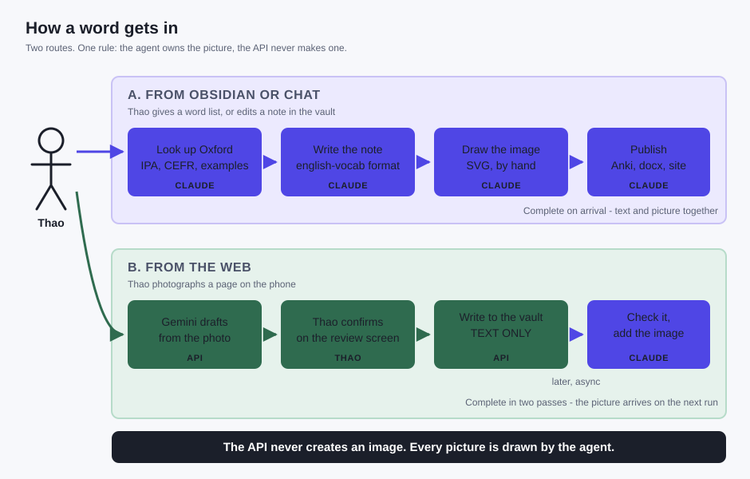

# How a word gets in

Two routes, and they divide on one line: **the agent owns the picture. The API
never makes one.**

## A. From Obsidian or chat

Thao gives a word list, or edits a note in the vault. The agent does the whole
item, in the `english-vocab` format:

1. look it up in Oxford **with a browser** - no API key is involved on this route
2. write the note: IPA, CEFR, meaning, Vietnamese gloss, examples, see-also
3. draw the picture as an SVG, filed under the item id
4. regenerate the Anki CSV and the docx, and publish the site

The note is complete when it lands. Nothing is left for a second pass.

## B. From the web

Thao photographs a page on the phone. Here the API does the reading, because
there is no agent on the phone:

1. Gemini drafts from the photo, using the `url_context` tool to check the word
   against Oxford itself - **this route does use the API key**, and its daily
   quota is the constraint
2. Thao confirms or corrects on the review screen
3. the API writes the item into the vault, **text only**

Then, later and asynchronously, the agent picks up items that have no picture,
checks them, and draws one. The note is completed in two passes.

## Why the split

An image is a judgement about meaning, not a transcription. Stock search returns
Cork the city for *cork* and The Cure for *cure*, and a wrong picture teaches a
wrong association - worse than no picture. Drawing is cheap, exact, needs no
licence and no API, so it belongs with the agent on both routes.

The API's job is narrower on purpose: get the words off the page and into the
vault, verified against Oxford, and stop there.
