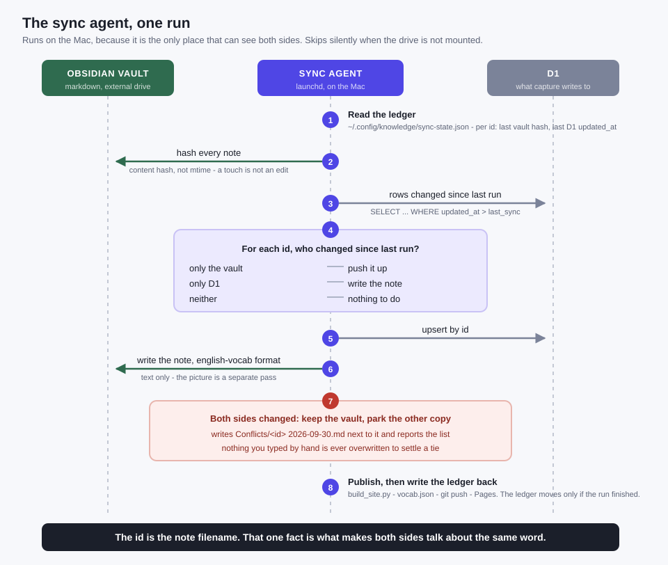

# Sync and keys



## Where things live

| | Holds | Written by |
|---|---|---|
| Obsidian vault | the notes, in markdown | Thao, and the sync agent |
| D1 | what web capture produced | the Worker |
| `data/vocab.json` | a published snapshot | `build_site.py`, on every sync |

The site reads the snapshot rather than D1, which is what keeps it free and
instant. Sync is what keeps the snapshot honest.

## The agent

Runs on the Mac under launchd - the vault is on an external drive, so nothing
in the cloud can reach it. If the drive is not mounted it exits quietly rather
than building a parallel copy somewhere else.

**Identity.** The item id is the note's filename. `grain.svg`, the `grain` row
in D1 and `Vocabulary/grain.md` are the same word because they share that one
name. Nothing else joins them.

**Change detection.** A content hash per note, not the modification time - a
touch, a re-save or a drive remount is not an edit. On the D1 side, `updated_at`.

**The ledger** at `~/.config/knowledge/sync-state.json` remembers, per id, the
hash and the `updated_at` as of the last completed run. That is what makes
"changed since last time" answerable on both sides at once. It is written back
only when a run finishes, so an interrupted run repeats rather than skips.

**Conflicts.** If both sides changed since the last run, the vault wins and the
other version is written to `Conflicts/<id> <date>.md` beside it, with the list
reported at the end of the run. Losing a hand-written example to an automatic
merge is the one failure worth designing against; a stray file you can delete
is the cheap end of that trade.

**Deletes are soft.** A row gets `deleted_at`; a note moves to `Archive/`. The
agent never deletes a file.

## Keys

The Worker tries `GEMINI_API_KEY`, then `GEMINI_API_KEY_2`, `_3` and so on, in
numeric order. Adding or removing one is a `wrangler secret put` - no deploy and
no code change - which is what lets a key be retired while a replacement is
already live.

```bash
./save-secret.sh GEMINI_API_KEY_2                 # local, for tests
cd worker && wrangler secret put GEMINI_API_KEY_2 # the Worker
```

A read moves to the next key only when the current one is **spent or rejected**
- 429, 401 or 403. It does **not** move on 503: that is the service being
saturated, which it is for every key at once, so trying another would spend two
requests to learn one thing. A normal read therefore costs exactly one request
no matter how many keys are held.

Every key is redacted out of error messages and logs, not just the first.
